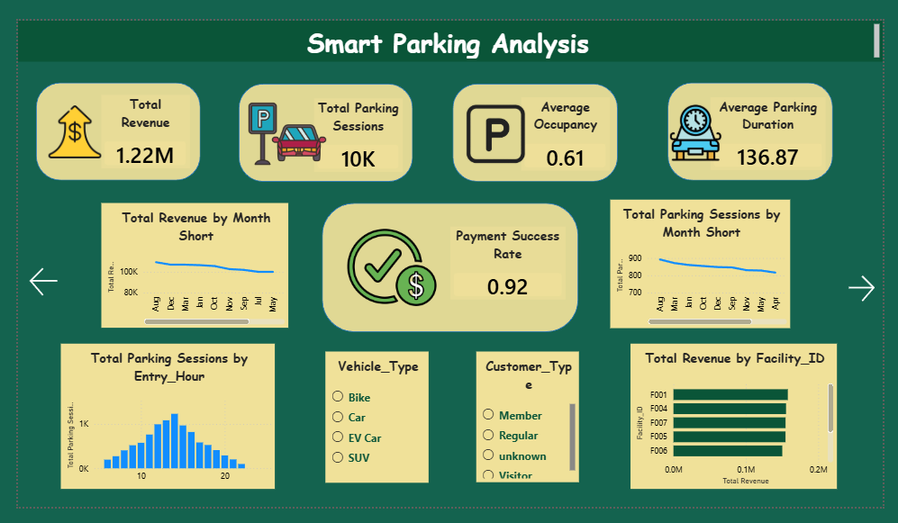
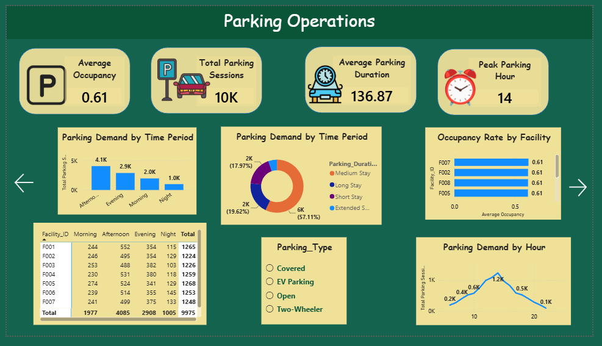

# 🚗 Smart Parking Analysis — SQL & Power BI

## 📌 Project Overview

Smart Parking Analysis is an end-to-end data analytics project designed to analyze parking operations, revenue performance, customer behavior, vehicle usage, occupancy, and parking demand.

The project uses **MySQL for database management and SQL analysis** and **Power BI for data transformation, modeling, DAX calculations, and interactive dashboard development**.

---

## 🎯 Business Problem

Parking operators need to understand how parking spaces are being utilized, when demand is highest, which facilities generate the most revenue, and how customer and vehicle behavior affects parking operations.

This project provides a centralized analytical dashboard to help management:

* Monitor parking occupancy
* Identify peak parking hours
* Analyze revenue performance
* Understand customer and vehicle behavior
* Identify high and low occupancy periods
* Compare parking facilities
* Support capacity and operational decisions

---

## 🎯 Project Objectives

* Analyze parking session activity
* Measure parking occupancy
* Identify peak parking hours
* Analyze parking revenue
* Compare revenue across parking facilities
* Analyze customer types and vehicle types
* Study parking duration patterns
* Analyze payment methods and payment status
* Identify high and low occupancy periods
* Provide business insights for parking optimization

---

## 🛠️ Tools & Technologies

| Tool        | Purpose                                     |
| ----------- | ------------------------------------------- |
| MySQL       | Database creation, storage and SQL analysis |
| SQL         | Data validation and business analysis       |
| Power Query | Data cleaning and transformation            |
| Power BI    | Dashboard development                       |
| DAX         | KPI and analytical calculations             |
| GitHub      | Project version control and portfolio       |

---

## 📊 Dataset

The project contains **10,000 parking transaction records** with 14 original columns.

### Main Columns

* Transaction_ID
* Facility_ID
* Vehicle_Type
* Customer_Type
* Entry_Date
* Entry_Hour
* Parking_Duration_Min
* Payment_Method
* Payment_Status
* Parking_Type
* Hourly_Rate
* Discount_Amount
* Net_Revenue
* Occupancy_Rate

Additional analytical columns were created during Power Query transformation:

* Entry_Hour_Category
* Parking_Duration_Category
* Occupancy_Category

---

## 🗄️ SQL Workflow

The dataset was first imported into MySQL.

### Database

```sql
CREATE DATABASE SmartParkingDB;
```

### Main Table

```text
parking_transactions
```

SQL was used for:

* Database creation
* Table creation
* Data validation
* Duplicate detection
* NULL analysis
* Data profiling
* Aggregation
* Business analysis

---

## 🔄 Power Query ETL

Power Query was used to clean and transform the data before dashboard development.

### Transformations

* Changed column data types
* Removed duplicate transactions
* Handled missing values
* Trimmed text values
* Cleaned text fields
* Validated numerical values
* Created Entry Hour Category
* Created Parking Duration Category
* Created Occupancy Category

### ETL Flow

```text
CSV
 ↓
MySQL
 ↓
Power BI
 ↓
Power Query
 ↓
Cleaned Dataset
 ↓
Data Model
 ↓
DAX
 ↓
Dashboard
```

---

## 📐 Data Model

A Date dimension was created in Power BI.

```text
Dim_Date
    │
    │ 1 : *
    ↓
Fact_ParkingTransactions
```

The relationship uses:

```text
Dim_Date[Date]
        ↓
Fact_ParkingTransactions[Entry_Date]
```

---

## 📈 DAX Measures

Important measures created include:

* Total Revenue
* Total Parking Sessions
* Average Parking Duration
* Average Occupancy
* Average Revenue per Session
* Paid Sessions
* Payment Success Rate
* Total Discount
* Paid Revenue
* Revenue per Parking Minute
* Peak Parking Hour
* Peak Occupancy
* High Occupancy Sessions
* Low Occupancy Sessions

---

# 📊 Power BI Dashboard

The report contains five analytical pages.

### 1. Executive Overview




Provides a high-level view of:

* Total Revenue
* Parking Sessions
* Average Occupancy
* Average Parking Duration
* Payment Success Rate
* Revenue trends
* Facility performance

### 2. Parking Operations



Analyzes:

* Facility occupancy
* Parking demand by hour
* Time-of-day demand
* Parking duration
* Vehicle type
* Weekday vs weekend demand

### 3. Revenue Analysis

Analyzes:

* Monthly revenue
* Revenue by facility
* Revenue by vehicle type
* Revenue by customer type
* Payment status
* Payment method
* Discount impact
* Revenue vs parking duration

### 4. Customer & Vehicle Analysis

Analyzes:

* Customer type distribution
* Vehicle type distribution
* Revenue by customer type
* Revenue by vehicle type
* Parking duration by customer type
* Customer and vehicle combinations

### 5. Capacity & Demand Analysis

Analyzes:

* Average and peak occupancy
* Occupancy risk categories
* Facility utilization
* Demand by day
* Demand by time of day
  
---

## 💡 Key Business Questions

The dashboard helps answer:

1. Which parking facility generates the highest revenue?
2. Which facility has the highest occupancy?
3. What are the peak parking hours?
4. Is parking demand higher on weekdays or weekends?
5. Which vehicle type uses parking most frequently?
6. Which customer type generates the most revenue?
7. What is the average parking duration?
8. Which payment method generates the most revenue?
9. Which facilities are highly utilized?
10. Which facilities are underutilized?
11. How does occupancy affect revenue?
12. When should management consider capacity optimization?

---

## 📌 Business Insights

The dashboard can be used to identify:

* High-demand parking facilities
* Underutilized facilities
* Peak parking periods
* Revenue-generating customer segments
* Vehicle usage patterns
* Payment behavior
* Parking duration patterns
* Potential capacity optimization opportunities

---

## 🚀 Future Improvements

Future versions of the project could include:

* Real-time parking sensor data
* Parking slot-level tracking
* Customer IDs and repeat-customer analysis
* GPS/location analytics
* Dynamic pricing analysis
* EV charging utilization
* Real-time occupancy monitoring
* Predictive parking demand using machine learning

---

## 👨‍💻 Project Workflow

```text
Data Collection
      ↓
MySQL Database
      ↓
SQL Data Validation
      ↓
Power Query ETL
      ↓
Data Modeling
      ↓
DAX Measures
      ↓
Power BI Dashboards
      ↓
Business Insights
      ↓
Recommendations
```

---

## 📁 Repository Structure

```text
Smart-Parking-Analysis/
│
├── Dataset/
├── SQL/
├── PowerBI/
├── Screenshots/
├── Documentation/
└── README.md
```

---

## ⭐ Project Skills Demonstrated

**SQL | MySQL | Data Cleaning | Power Query | Data Modeling | DAX | Power BI | Data Visualization | KPI Development | Business Analysis**
